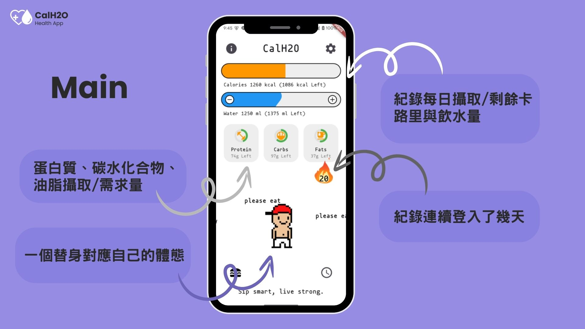
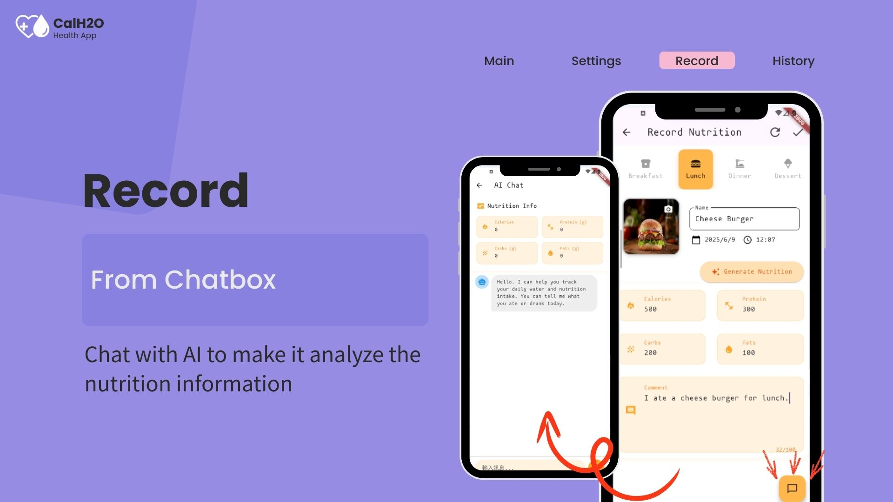
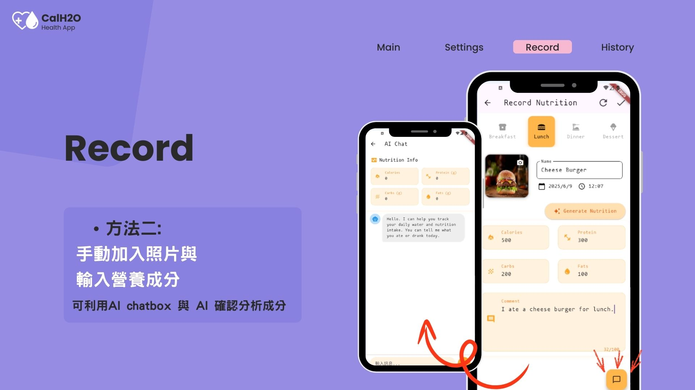
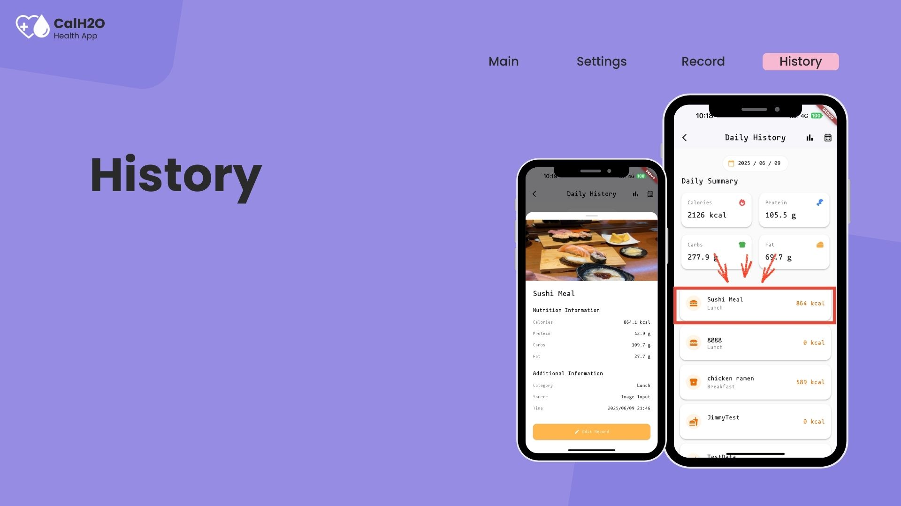
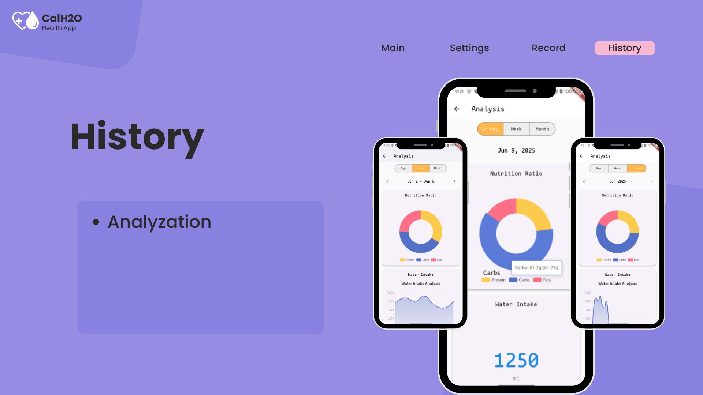

# CalH2O

A Flutter health app that tracks daily calorie intake, water consumption, and nutritional balance with AI-powered food recognition.

## Screenshots

### Login / Info Page


### Main


### Record



### History



## Getting Started

This project is built with Flutter. To run:

```bash
flutter pub get
flutter run
```

You will need to configure your own Firebase project and run `flutterfire configure` to generate `firebase_options.dart`.
